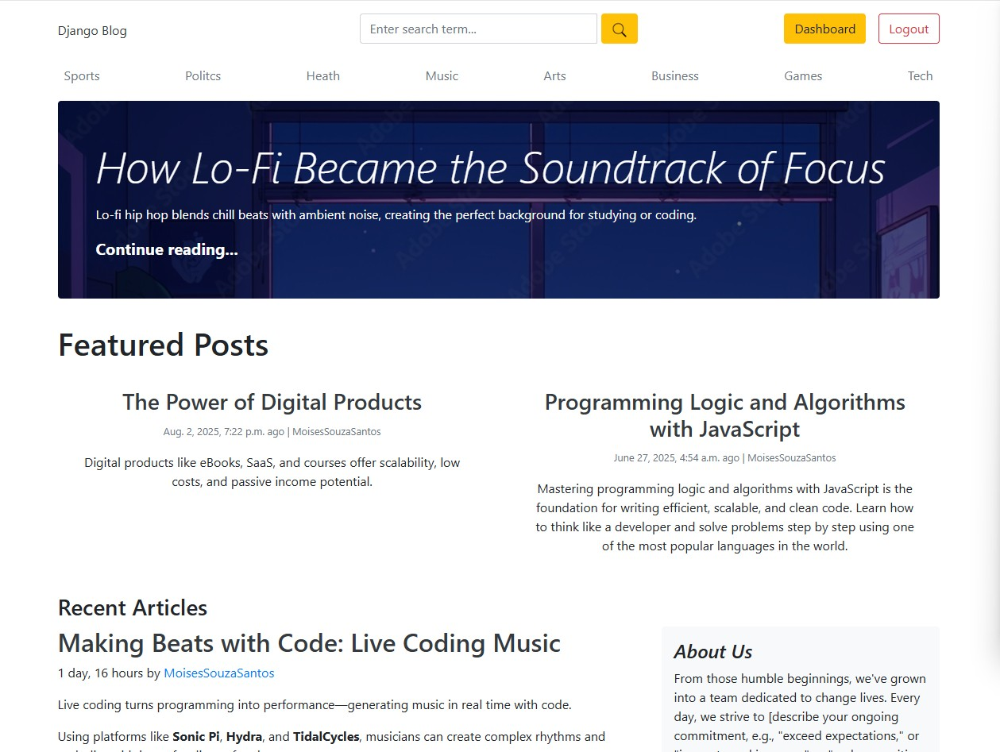
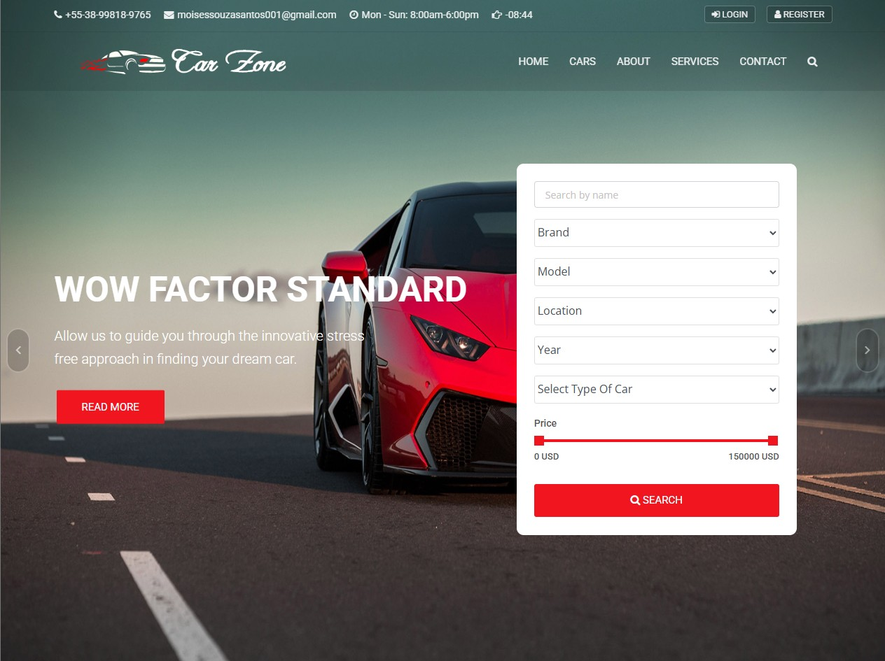
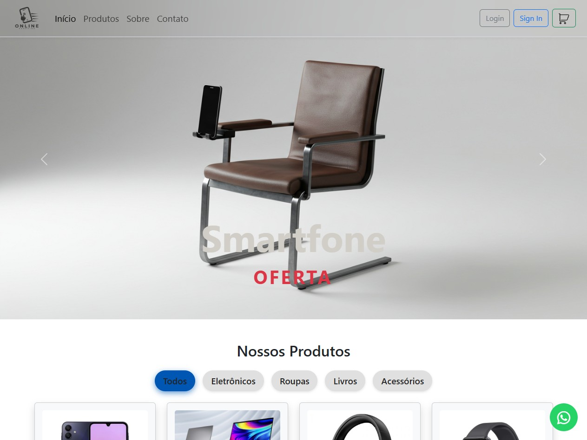
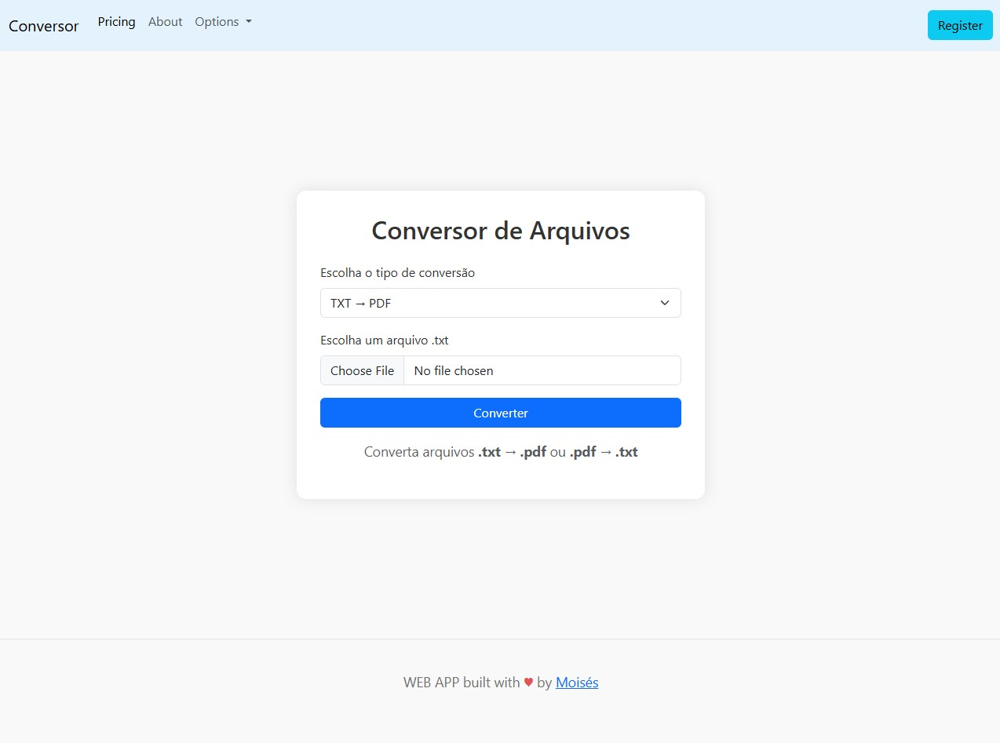

<h1 align="center">👨🏻‍💻 Moisés Souza</h1>
<h3 align="center">Software Engineer | Web & Mobile Developer | Web Scrapper</h3>

 • <a href="mailto:moisessouzasantos001@gmail.com">✉️ E-mail</a> •
  <a href="https://www.linkedin.com/in/mois%C3%A9s-souza-santos/">💼 LinkedIn</a> •
  <a href="https://portfolio-moises01.netlify.app/">🧑‍💼 Portfolio</a> •
  <a href="https://www.youtube.com/@MoisesSouza577">🔴 Youtube</a> •
  <a href="https://wa.me/5538998189765">📱 WhatsApp</a>

---

### 👋 About Me

My name is **Moisés Souza Santos**, I’m 24 years old and based in Minas Gerais, Brazil. I’m a curious and analytical developer, always seeking to learn new technologies and deepen my existing skills.  
My main interests include **web and mobile development**, **cybersecurity**, and **language learning**.
- 🎓 Computer Engineering student  
- 💻 Focused on Web Development
- 📚 Over 50 certifications in the tech field  
- 🌍 Fluent in English, learning Norwegian 🇳🇴 and Japanese 🇯🇵  
- 🚀 Actively looking for internship opportunities in tech  
- ❤️ Passionate about building meaningful projects and making a difference through technology

---

<h1>🏆 Featured Certifications 🏆</h1>

<table>
  <tr>
    <td>📱</td>
    <td><strong>Responsive Web Design</strong> freeCodeCamp</td>
  </tr>
  <tr>
    <td>⚙️</td>
    <td><strong>JavaScript Algorithms and Data Structures</strong> freeCodeCamp</td>
  </tr>
  <tr>
    <td>🎨</td>
    <td><strong>Front-End Development</strong> Digital Innovation One (DIO)</td>
  </tr>
  <tr>
    <td>📄</td>
    <td><strong>HTML & CSS for Beginners</strong> Curso em Vídeo</td>
  </tr>
  <tr>
    <td>🧠</td>
    <td><strong>JavaScript Moderno (ES6+)</strong> Origamid</td>
  </tr>
  <tr>
    <td>🔧</td>
    <td><strong>Git e GitHub para Iniciantes</strong> DIO</td>
  </tr>
  <tr>
    <td>⚛️</td>
    <td><strong>Introdução ao React</strong> Alura</td>
  </tr>
  <tr>
    <td>🌐</td>
    <td><strong>Node.js e Express</strong> DIO</td>
  </tr>
  <tr>
    <td>💼</td>
    <td><strong>Desenvolvimento Web Full Stack</strong> Fundação Bradesco</td>
  </tr>
</table>

> 💡 I've completed over 50 certifications in technology, focusing on Web Development and related tools.

---

### 🛠️ Tech Stack

  &nbsp;
  &nbsp;
  &nbsp;
  &nbsp;
  &nbsp;
  &nbsp;
  &nbsp;
  &nbsp;
  &nbsp;
  &nbsp;
  &nbsp;
  &nbsp;
  &nbsp;
  &nbsp;
  &nbsp;
  &nbsp;
  &nbsp;

---

### 📈 GitHub Insights

  <!-- GitHub Stats -->
  
  
  <!-- Linguagens Mais Usadas -->
  

  <!-- Heatmap de Contribuições -->
    
  

---

### 🐍 Contribution Snake Animation

<picture>
  <source media="(prefers-color-scheme: dark)" srcset="https://raw.githubusercontent.com/platane/snk/output/github-contribution-grid-snake-dark.svg" />
  <source media="(prefers-color-scheme: light)" srcset="https://raw.githubusercontent.com/platane/snk/output/github-contribution-grid-snake.svg" />
  
</picture>

---

### 🚀 Featured Projects

Here are some of my most recent and notable projects with detailed descriptions:

  

    
    <strong>🌐 <a href="https://github.com/LinuxEater/blog-news-project" target="_blank">Blog News</a></strong> 
    A blog platform for publishing news articles. Features category-based organization, image attachments, admin content management, and a clean responsive interface. 
    <strong>Technologies used:</strong>
    <ul>
      <li>Django</li>
      <li>Python</li>
      <li>HTML/CSS</li>
      <li>Bootstrap (optional)</li>
    </ul>
  

  

    
    <strong>🚗 <a href="https://github.com/LinuxEater/Carstore-Project" target="_blank">Carstore Project</a></strong> 
    Car dealership platform with product listing, filtering, and admin panel management. 
    <strong>Technologies used:</strong>
    <ul>
      <li>Django</li>
      <li>Python</li>
      <li>HTML/CSS</li>
      <li>Bootstrap</li>
    </ul>
  

  

    
    <strong>🛒 <a href="https://github.com/LinuxEater/full-ecommerce-clothes" target="_blank">Clothes Ecommerce</a></strong> 
    Fully featured ecommerce site with cart, authentication, and product management. 
    <strong>Technologies used:</strong>
    <ul>
      <li>Django</li>
      <li>Python</li>
      <li>JavaScript</li>
      <li>Bootstrap</li>
      <li>HTML/CSS</li>
    </ul>
  

  

    
    <strong>📊 <a href="https://github.com/LinuxEater/investments-dashboard" target="_blank">Investments Dashboard</a></strong> 
    Interactive real-time investment visualization dashboard. 
    <strong>Technologies used:</strong>
    <ul>
      <li>React</li>
      <li>Chart.js</li>
      <li>Tailwind CSS</li>
      <li>JavaScript (ES6+)</li>
    </ul>
  

  

    
    <strong>🧩 <a href="https://github.com/LinuxEater/conversor-de-arquivos-1.0" target="_blank">File Converter Micro SaaS</a></strong> 
    Simple SaaS platform for converting files between formats. 
    <strong>Technologies used:</strong>
    <ul>
      <li>Django</li>
      <li>Python</li>
      <li>JavaScript</li>
      <li>HTML/CSS</li>
    </ul>
  

---

    

---

### 🎥 Latest YouTube Videos

Stay tuned with my latest development content on YouTube:

- [🔗 TODO Django Web App](https://www.youtube.com/watch?v=eqeZ8Y5HoaY)  
- [🔗 Employees System Management](https://www.youtube.com/watch?v=q6Ho0WyKYFQ)  
- [🔗 Personal Portfolio 🔥](https://www.youtube.com/watch?v=Ckf3m6astcE)

> 📺 [Subscribe to my channel](https://www.youtube.com/@MoisesSouza577)

---

### 📬 Contact Me

If you're interested in working together, collaborating or just want to say hi:

📧 **moisessouzasantos001@gmail.com**  
🔗 [LinkedIn](https://www.linkedin.com/in/mois%C3%A9s-souza-santos/)  
📱 [WhatsApp](https://wa.me/5538998189765)  
🌐 [Portfolio](https://portfolio-moises01.netlify.app/)

---

> *"Success is the sum of small efforts, repeated day in and day out."*
